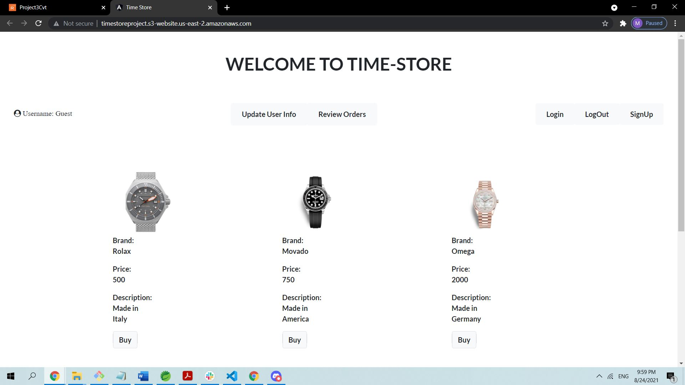

# Time Store

- Time Store is a full stack e-commerce application where watches of different brands are sold. 
- Users can buy watches, add them to wishlist and rate the products. Watch name, brand, description and price is displayed alongside the watch picuture. 
- Automated email messages are send to users on log ins, sign ups, purchases, and user information changes.

## Front End Technologies Used:

- Angular, 
- HTML, 
- CSS, 
- Bootstrap, 
- Font Awesome.

## Back End Technologies Used:

- Maven, 
- Spring JPA, 
- Spring Data, 
- Spring Boot, 
- Web Services, 
- Lombok, 
- PostgreSQL, 
- Spring Mail.

## Deployment

- Jenkins pipeline was used to automate the deployment process of this web application. 
- An AWS EC2 instance was used to store the back-end and run the web server. 
- Front-end was hosted on an AWS S3 bucket. 

